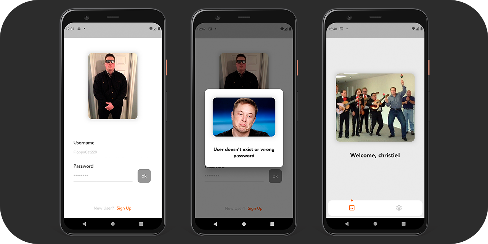

### Написать приложение “Авторизация”. Пользователь должен иметь возможность авторизоваться (выполнить вход или регистрацию в сервисе). После успешной авторизации показываем пользователю экран с картинкой №1. Если “что-то пошло не так” и авторизоваться не удалось, то уведомляем пользователя о возникшей ошибке показываем экран с картинкой №2.

Приложения:

	Картинка №1 “Успешная авторизация” https://skr.sh/sDdxnoyYOGB
	Картинка №2 “Ошибка” https://skr.sh/sDdzJXaVrly
 
**Использованные пакеты**
- bloc
- flutter_bloc
- cached_network_image
- hive
- hive_flutter
- equatable
- loading_animation_widget
- responsive_sizer
- skeletons
- page_transition
- shared_preferences